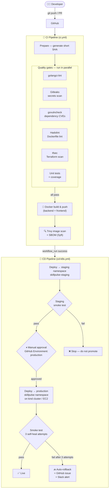
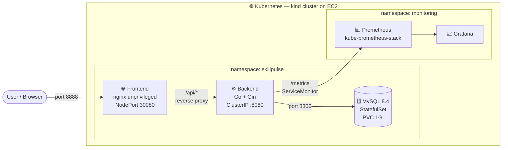
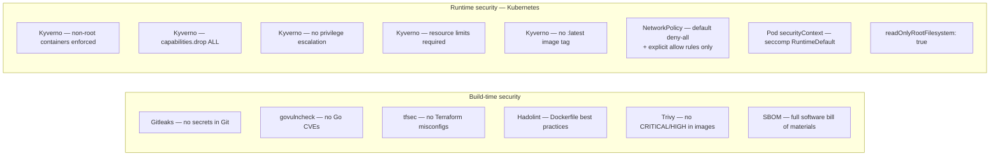

# SkillPulse — Architecture & Pipeline

## CI/CD pipeline



## Application architecture



## Security controls



## Reliability controls

| Control | What it does |
|---|---|
| `startupProbe` | Gives backend 60s to connect to MySQL before liveness kicks in |
| `livenessProbe` | Restarts pod if app hangs or deadlocks |
| `readinessProbe` | Removes pod from load balancer if it can't serve traffic |
| `PodDisruptionBudget` | Ensures at least 1 pod stays up during node drains / cluster upgrades |
| `HorizontalPodAutoscaler` | Scales backend 2–5 replicas on CPU >60% and memory >75% |
| Rolling update `maxUnavailable: 0` | Zero-downtime deploys — always keeps full capacity |
| Graceful shutdown (30s) | Drains in-flight requests before pod is terminated |
| 3 self-heal smoke tests | Automatically restarts and retests before triggering rollback |
| Auto-rollback | Reverts to last known-good revision on deploy failure |

## Repository structure

```
.
├── .github/
│   ├── workflows/
│   │   ├── ci.yml                  # Main CI orchestrator
│   │   ├── cd-k8s.yml              # CD: staging → production
│   │   ├── code-quality.yml        # golangci-lint
│   │   ├── secrets-scan.yml        # Gitleaks
│   │   ├── dependency-scan.yml     # govulncheck
│   │   ├── docker-lint.yml         # Hadolint
│   │   ├── docker-image-scan.yml   # Trivy + SBOM
│   │   ├── docker_build_push.yml   # Build & push (reusable)
│   │   ├── terraform-scan.yml      # tfsec
│   │   └── unit-tests.yml          # Go test + coverage
│   └── dependabot.yml              # Weekly auto-PRs
├── backend/                        # Go + Gin REST API
├── frontend/                       # Nginx static site
├── k8s/                            # Kubernetes manifests
│   ├── 00-namespace.yaml
│   ├── 10-mysql.yaml               # MySQL StatefulSet
│   ├── 20-backend.yaml             # Backend Deployment + Service
│   ├── 30-frontend.yaml            # Frontend Deployment + NodePort
│   ├── 40-network-policy.yaml      # Default deny + allow rules
│   ├── 50-pdb.yaml                 # PodDisruptionBudgets
│   ├── 60-monitoring.yaml          # ServiceMonitor + PrometheusRule
│   ├── 70-kyverno-policies.yaml    # Admission control policies
│   └── 80-hpa.yaml                 # HorizontalPodAutoscalers
├── terraform/                      # EC2 + SG + key pair
├── ansible/
│   ├── playbook.yml                # Install Docker, kind, kubectl
│   └── install-observability.yml   # Install Helm + kube-prometheus-stack
└── docs/
    └── architecture.md             # This file
```
